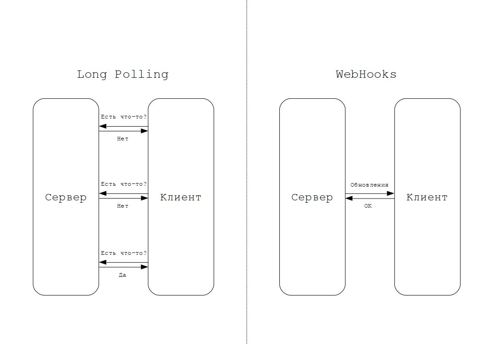
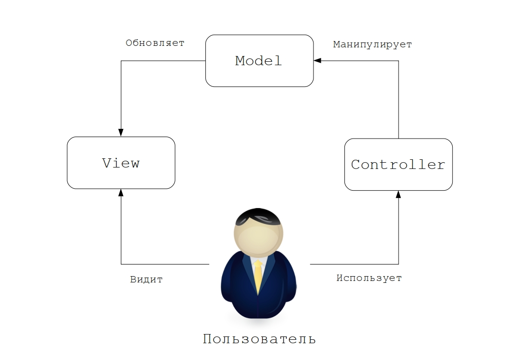
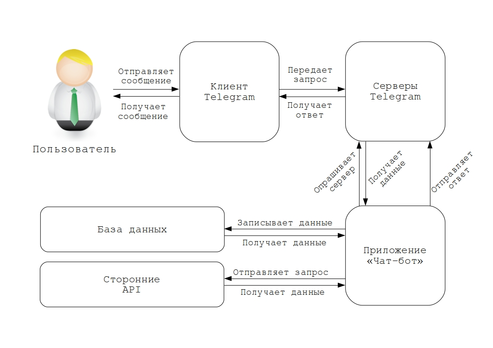

# Телеграм-бот для студентов СКФ МТУСИ

[Телеграм-бот](https://t.me/mtusi_bot) для студентов СКФ МТУСИ, позволяющий в удобной форме получить информацию о преподавателях, звонках, расписании занятий и многом другом.

[Мобильная версия (YouTube)](https://www.youtube.com/watch?v=wDebFUeASxA)  
[Десктопная версия (YouTube)](https://www.youtube.com/watch?v=Nf0OsWZCXbQ)

---

## Список реализованных функций

1. Пары в текущий момент времени (с точностью до секунды).
2. Пары сегодня.
3. Пары завтра.
4. Расписание звонков (ввиду пандемии меняется в соответствии с выбранной группой).
5. Расписание занятий.
6. Загрузка PDF-файлов с различными расписаниями.
7. Возможность изменить свою группу.
8. Основная информация о преподавателях (в т.ч. и фотография), распределенных по кафедрам.
9. Возможность использования бота в inline-режиме - можно узнать информацию о преподавателе в другом чате или диалоге введя в строку сообщения "@mtusi_bot".
10. Некоторые служебные и отладочные функции: /help, /start, /ping, /photo и т.п.
11. Справочная информация (адрес, телефон, часы работы).

Более подробное описание функционала доступно по [ссылке](#functions).

---

## Краткая инструкция пользователя

1. Необходимо иметь аккаунт в Telegram и установленное приложение на смартфоне или ПК.
2. В строке поиска нужно ввести: @mtusi_bot.
3. В выдаче выбрать первую (или одну из первых) ссылку с названием "Бот СКФ МТУСИ".
4. Нажать внизу экрана на кнопку "ЗАПУСТИТЬ".

---

## Инструкция по развертыванию проекта

Предполагается, что используется unix-подобная операционная система.
Для успешного развертывания проекта необходимо иметь установленные ```git```, ```docker``` и ```docker-compose```. Также необходимо иметь аккаунт в мессенджере Телеграм.

Клонируем данный репозиторий в текущую директорию:

```bash
git clone https://github.com/vlad-gavrilov/skf_mtusi_telegram_bot.git
```

Внутри проекта копируем файл ```.env_example``` с новым именем ```.env```:

```bash
cp .env_example .env
```

В файле ```.env``` заполняем переменные ```DB_HOST```, ```DB_NAME```, ```DB_USER```, ```DB_PASS```, ```DB_ROOT_PASS``` соответствующими значениями. Например:

```text
DB_HOST="db"
DB_NAME="skf_mtusi_bot"
DB_USER="user"
DB_PASS="password"
DB_ROOT_PASS="rootpassword"
```

Получаем API-токен к чат-боту. Подробно этот процесс описан [здесь](https://boto.agency/blog/kak-polychit-api-token-telegram/). Полученный токен указываем в качестве значения переменной ```TG_TOKEN```.

Запускаем проект командой:

```bash
docker-compose up --build
```

Если все прошло успешно, проект должен находиться в рабочем состоянии. Проверить это можно зайдя в соответствующего бота и отправив ему команду ```/ping```. В ответ должно прийти сообщение "pong".

Останавливаем проект командой:

```bash
docker-compose stop
```

---

1. [Введение](#intro)
2. [Анализ предметной области](#analysis)
    1. Понятие чат-бота
    2. Преимущества и недостатки использования чат-ботов
    3. Области применения чат-ботов
    4. Использование чат-ботов в качестве интерфейса приложения
    5. Конструкторы для разработки чат-ботов
    6. Фреймворки для разработки чат-ботов
3. [Проектирование и алгоритмическое конструирование](#design)
    1. JavaScript
    2. ECMAScript
    3. Node.js
    4. Пакетный менеджер npm
    5. Фреймворк node-telegram-bot-api
    6. Long Polling vs WebHooks
    7. Шаблон MVC
    8. Взаимосвязь проекта с платформой
    9. Описание функционала проекта
4. [Программная реализация проекта](#implementation)
    1. Структура приложения
    2. Описание основных компонентов
    3. Описание используемых библиотек
5. [Тестирование программного проекта](#testing)
    1. Основы тестирования
    2. Тестирование приложения с использованием фреймфорка Jest

<a name="intro"><h2>1. Введение</h2></a>

В современном мире технологии развиваются с высокой скоростью и мессенджеры постоянно предлагают пользователям новые возможности. Одна из таких возможностей это создание чат-бота — программы, позволяющей общаться с пользователем в автоматическом режиме, круглосуточно, без привлечения реального человека. В настоящее время практически все современные мессенджеры предоставляют возможность создания чат-ботов. Область применения чат-ботов очень широкая: от поиска музыкальных композиций до рекламных промо-акций, от кулинарного помощника до помощника, подбирающего одежду в соответствии с погодой в указанной местности, от напоминаний о приеме лекарств до робота, отправляющего изображение в соответствии с заданным описанием.

По статистическим данным, с 2018 года количество пользователей мобильных устройств превысило количество пользователей десктопа, причем в будущем эта тенденция будет только усиливаться. Мессенджеры стали одним из самых популярных классов приложений на мобильных устройствах. Все эти факторы обуславливают появление новых требований пользователей к взаимодействию с различными брендами:

- Взаимодействие должно затрачивать минимальное количество усилий;
- Должна присутствовать возможность взаимодействия с помощью смартфона;
- Должны использоваться привычные пользователю  социальные приложения;
- Запрос пользователя должен быть мгновенно обработан.

Все вышеуказанные требования могут быть выполнены посредством чат-ботов.
Наибольшее распространение чат-боты получили за рубежом — в англоязычных странах и странах Азии. По статистике:

- около 40% миллениалов используют чат-ботов каждый день;
- около 35% потребителей хотят, чтобы бренды, которыми они пользуются, имели чат-ботов;
- около 55% опрошенных хотят получать моментальных ответ от чат-бота;
- для около 21% респондентов чат-бот является одним из самых простых способов коммуникации.

Как правило, типичное применение чат-бота это автоматизация некоторого простого, на часто повторяющегося действия. Например, узнать расписание, выпить вовремя лекарства, забронировать место в кинотеатре и тому подобное.

<a name="analysis"><h2>2. Анализ предметной области</h2></a>

### Понятие чат-бота

Под ботом обычно подразумевается некоторая программа, которая выполняет определенные действия через интерфейс, предназначенный для человека. Как правило, они используются для выполнения однотипных действий для увеличения скорости выполнения. Также боты могут использоваться для обеспечения более быстрой реакции на определенные события. Различных ботов объединяет то, что они имитируют поведение человека. Одной из разновидностей ботов является чат-бот.
Чат-бот это программа, имитирующая собеседника в чате. Она в автоматическом режиме позволяет удовлетворить потребности пользователя. В большинстве случаев, чат-бот ведет диалог от лица некоторой организации для оперативного предоставления актуальной информации.

Обычно чат-бот функционирует на основе некоторого мессенджера — программы, позволяющей пользователям обмениваться мгновенными сообщениями. Это означает, что чат-бот может отвечать на вопросы пользователя, а также задавать дополнительные вопросы в режиме реального времени. Отличием от реального пользователя является то, что чат-бот может вести диалог с многими клиентами одновременно. Также чат-бот доступен круглосуточно, в то время как обычный пользователь доступен только в определенное время.

### Преимущества и недостатки использования чат-ботов

К основным преимуществам использования чат-ботов относится снижение затрат ввиду того, что многие рутинные задачи могут быть выполнены компьютерной программе, а не человеком.

Стоить также отметить, что автоматизированные решения, которыми и являются чат-боты, менее склонны к ошибкам по сравнению с реальным человеком. При условии правильно составленного алгоритма вероятность возникновения ошибки во время работы чат-бота близка к нулю.
Также плюсом чат-бота является его многозадачность — он может общаться со множеством пользователей одновременно, в то время как реальный человек с большим трудом сможет вести диалог одновременно с несколькими людьми и тем более с несколькими сотнями или даже тысячами пользователей. Также стоит отметить, что чат-бот работает круглосуточно, без выходных и праздников. В то время как обыкновенная техподдержка работает только в определенное время.

Преимущество чат-бота также в том, что он в любом случае ответит на запрос пользователя, даже если он не знает что именно нужно ответить на данных запрос. В худшем случае это может быть уведомление о том, что чат-бот по каким-то причинам недоступен и не может обработать запрос. Но это все же лучше, чем молчание реального оператора, который каким-либо причинам не может ответить на запрос. Также чат-бот помнит всю переписку и в случае изменения статуса запроса пользователя непременно оповестит его об изменениях.

Еще одним преимуществом является практически моментальная реакция чат-бота на действия пользователя. При использовании чат-бота нет необходимости ожидать пока человек-оператор прочитает вопрос, найдет ответ и сообщит его пользователю. В некоторых случаях, если вопрос пользователя нетривиален, то он может быть передан настоящему человеку-оператору, который в ручном режиме ответит на него. Таким образом оператор сможет сконцентрироваться на сложных вопросах и не тратить время на однотипные повторяющиеся вопросы.

Несмотря на перечисленные преимущества, использование чат-ботов имеет также и некоторые недостатки. К таким недостаткам в первую очередь относится то, что чат-боты не всегда могут быть применимы в текущих условиях. Иногда пользователю может быть удобнее воспользоваться не текстовым интерфейсом, а графическим или вовсе обратиться на горячую линию.

В случаях, если область устроена таким образом, что от пользователей приходят нестандартные запросы, использование чат-бота также неуместно и правильнее было бы использовать другие способы коммуникации с ними.
Также минусом является то, что текстовый интерфейс не всегда в полной мере отображает все возможности бота, в то время как приложения с графическим интерфейсом явно дают знать что стоит ожидать от данного продукта. Обнаружение границ возможностей чат-бота происходит методом «проб и ошибок» пользователя.

### Области применения чат-ботов

Чат-боты позволяют облегчить решение задач в различных областях. Перечислим основные области, в которых применение чат-ботов показало себя наиболее продуктивно.

*Развлекательные чат-боты.* Позволяют в удобной форме получать развлекательный контент либо же приобретать или бронировать билеты на различные мероприятия развлекательного характера. Например, чат-бот, позволяющий просмотреть афишу некоторого кинотеатра, даты премьер, количество доступных мест, их стоимость, забронировать места и тому подобное.

*Туристические чат-боты.* Такой вид чат-ботов позволяет упростить задачу выбора места для проведения отпуска с учетом всех пожеланий пользователя. Чат-бот учитывает все пожелания и ограничения, наложенные клиентом, и на их основе выдает оптимальный вариант, доступный у данной туристической компании. Плюсом является и то, что вместо заполнения множества анкет определение оптимального варианта происходит посредством удобного диалога в мессенждере. В случае, если вариант устраивает пользователя, чат-бот поможет забронировать авиабилеты и заблаговременно напомнит пользователю о назначенной дате.

*Новостной чат-бот.* Многие новостные издания используют чат-ботов в качестве средства доставки контента до конечного пользователя. Это происходит посредством использования кратких и удобных текстовых сообщений в различных мессенджерах.

*Бот-секретарь.* В связи с особенностями профессиональной деятельности некоторым людям может быть полезен свой персональный помощник. Но так как не всякий человек может позволить себе настоящего секретаря, на помощь приходят чат-боты. Они позволяют выполнять большинство задач, которые обычно берет на себя секретарь. Например, составлять список задач на конкретный день либо напоминать о предстоящей встречи.

*Служба поддержки.* Чат-бот может выступать  в роли первой линии технической поддержки. Алгоритм техподдержки, как правило, четко регламентирован, а значит может быть реализован и в программном коде. Чат-боту необходимо получить запрос, понять его смысл и выдать релевантный ответ.

*Чат-бот университета.* Не так давно этот вид чат-ботов стал очень популярен. Многие ведущие университеты по всему миру используют чат-ботов. Они позволяют в быстрой и удобной форме получить нужную информацию как студентам, так и преподавателям. Расписание звонков, пар, список преподавателей, телефон деканата — это лишь малый список того, что возможно получить буквально за несколько кликов не выходя из мессенджера. В отличие от полноценного мобильного приложения или сайта, ответ не заставит себя ждать даже при использовании слабого интернет-соединения по мобильной сети. Также в период поступления абитуриентов чат-бот может облегчить работу приемной комиссии выступая в роли первой линии поддержки, отвечая на типичные вопросы абитуриентов, автоматизируя процесс приема документов, предсказывая вероятность поступления абитуриента и тому подобное.

Это основные области использования чат-ботов. Помимо перечисленного существует огромное количество других областей, которые возможно автоматизировать с использованием различных чат-ботов.

### Использование чат-ботов в качестве интерфейса приложения

Основной принцип работы с чат-ботом это обмен текстовой информацией пользователя с программой. В самом простом виде этот процесс описывается следующим алгоритмом: пользователь отправляет текстовый запрос, бот принимает этот запрос, обрабатывает его и на основе обработанного запроса отправляет тот или иной ответ пользователю. Такой подход напоминает консольные приложения для ПК, разрабатываемые до того, как появился и стал популярен [GUI (Graphical User Interface)](https://en.wikipedia.org/wiki/Graphical_user_interface). В качестве устройства ввода в то время была как правило клавиатура, а в качестве устройства вывода — терминал, которой мог отображать только символы. В настоящее время устройство вывода не изменилось, а вывод отображается внутри мессенджера, который используется в первую очередь для обмена именно текстовой информацией. Таким образом, мессенджер является тем новым «терминалом», который позволяет отобразить результат в виде, напоминающим вывод консольной программы. По аналогии с терминалом, клиентов может быть много и они могут находиться в отдаленности от вычислительного центра — сервера. Все вычислительная нагрузка ложится именно на сервер, пользователь в данном случае является «тонким» клиентом. Задача пользовательского оборудования корректно принять и отобразить данные. В итоге мы пришли к тому, что чат-бот выступает в роли более современного и усовершенствованного [CLI (Command-Line Interface)](https://en.wikipedia.org/wiki/Command-line_interface). Чат-ботов можно использовать в качестве альтернативного интерфейса для уже существующих приложений — вместо громоздких веб-сайтов и приложений, которые помимо полезной информации тянут за собой «шлейф» из интерфейсов, стилей, мультимедиа и прочих тяжелых данных. Это особенно важно в век развития мобильных устройств так как не везде существует доступ к высокоскоростному мобильному интернету. Также такой подход позволяет при меньших затраченных усилиях охватить большую аудиторию через различные платформы. Достаточно адаптировать пользовательский интерфейс в виде чат-бота к уже существующей серверной составляющей приложения и появится возможность прямо внутри мессенджера делать то, что можно было делать только через веб-сайт.

### Конструкторы для разработки чат-ботов

Существует несколько путей создания чат-ботов. Самый простой из них это использование специализированных конструкторов. Чтобы сделать бота через конструктор не нужно обладать навыками программирования. Все, что необходимо сделать — это иметь учетную запись в мессенджере, указать имя и параметры бота, а также прописать все возможные варианты общения с ним. Сервис на основе указанных данных самостоятельно генерирует бота, который будет в полной мере реализовать указанный функционал. Также пользователям доступна интеграция с различными аналитическими сервисами, которые позволяют получать статистику использования чат-бота. Но за эту простоту приходится платить гибкостью и стоимостью. Большинство конструкторов крайне ограничены в своем функционале, и это даже при условии использования платной версии. В бесплатных версиях возможно реализовывать только базовые функции. Перечислим основные платформы.

1. [Aimylogic](https://aimylogic.com). Сервис оперирует естественным языком и позволяет создавать ботов, способных угадывать намерения пользователей. Присутствует возможность встраивать построенного бота в различные мессенджеры, социальные сети, голосовых помощников. Доступны как бесплатная версия, так и платная.
2. [Bot Kits](https://botkits.ru). Создание чат-ботов с использованием этой платформы сопряжено с оперированием различными блок-схемами. Построенный бот может собирать всю доступную статистику, а также понимать запросы, звучащие по-разному, но похожие по смыслу. Также существует возможность создания рассылок. Из поддерживаемых платформ можно выделить: Telegram, Facebook Messenger, Viber, Skype, «ВКонтакте», «Одноклассники».  Использование платное.
3. [Botmother](https://botmother.com). Как гласит главная страница сайта «Botmother — это мощная CMS для чат-ботов». То есть суть этой платформы заключается в создании среды, в которой можно соединив отдельные блоки в единое целое получить готовый продукт. Платформа позволяет создавать чат-ботов, в которые интегрированы статистика, рассылки, запросы к сторонним API, прием платежей. Поддерживаемые мессенджеры: Telegram, Facebook Messenger, Viber, «ВКонтакте», «Одноклассники». Доступна бесплатная демо-версия, далее доступ предоставляется на коммерческой основе.
4. [Botsify](https://botsify.com). Основной особенностью этой платформы является создание чат-ботов с использованием методов машинного обучения. Поддерживаются мессенджеры  Facebook Messenger и Slack. Использование платное.
5. [Chatfuel](https://chatfuel.com). Позволяет создавать ботов для Facebook Messenger. Огромным преимуществом данной платформы является большое количество различных шаблонов чат-ботов для различных направлений. В платформу встроен инструмент распознавания речи.
6. [Chatgun](https://chatgun.io). С помощью этой платформы возможно создавать чат-ботов для «ВКонтакте», которые смогут осуществлять сбор данных и таргетированные рассылки. Использование платное.
7. [Manybot](https://manybot.io). По-сути, эта платформа является ботом в Telegram, который позволяет создавать других чат-ботов для Telegram. В нем можно создавать собственное многоуровневое меню, команды, новостные рассылки и прочее. Плюсами данной платформы является ее бесплатность и поддержка многих языков.
8. [Robochat.io](https://robochat.io). Данный конструктор позволяет создать различных ботов для «Вконтакте» - от простого диалогового бота до мини-игры. Возможно собирать информацию о пользователях и на основе полученных данных рассылать таргетированные сообщения. Возможно только платное использование.

### Фреймворки для разработки чат-ботов

Если для использования специализированных платформ для создания чат-ботов пользователю не обязательно иметь навыки программирования, то для использования фреймворков нужны как минимум основы программирования так как, по-сути, фреймворк — это библиотека для определенного языка программирования. Фреймворки можно классифицировать по поддержке того или иного языка программирования: это может быть фреймворк для Python, JavaScript, C# или же сразу для нескольких языков. Также можно провести разделение по поддерживаемым мессенджерам: фреймворк только для Telegram, Facebook Messenger, «ВКонтакте» или же универсальный фреймворк, который позволяет за один раз создать чат-бота для нескольких мессенджеров. Плюсы и минусы различных подходов очевидны. Универсальность влечет за собой меньшую гибкость. Если разработчик хочет создать проект, который будет работать сразу в нескольких мессенджерах, то он должен позаботиться о том, чтобы разрабатываемый функционал был доступен во всех целевых платформах. Например, один из мессенджеров не поддерживает функцию создания голосований и поэтому от этой функции придется отказаться во всех мессенджерах даже несмотря на то, что все остальные мессенджеры ее поддерживают. Рассмотрим несколько основных примеров фреймворков для разработки чат-ботов.

1. [Botkit](https://www.botkit.ai/). Это фреймворк для серверного JavaScript — Node.js, написанный на TypeScript и приобретенный Microsoft. Он предлагает пользователю единый интерфейс для отправки и приема сообщений. Изначально написанный для мессенджера Slack, теперь поддерживает множество различных платформ. Фреймворк позволяет подключать нативные и сторонние компоненты для обработки естественных языков, например LUIS.ai от Microsoft. Базовый функционал реализован посредством обработчиков событий. Различные платформы поддерживаются через специализированные коннекторы. После покупки корпорацией Microsoft стал частью Microsoft Bot Framework.
2. [Microsoft Bot Framework](https://dev.botframework.com/). Фреймворк, представленный Mcirosoft в 2016 году на конференции Microsoft Build, является комплексным решением для создания и деплоя чат-ботов для различных платформ. Большое преимущество этого фреймворка в том, что он позволяет писать ботов без привязки к конкретному мессенджеру. Microsoft Bot Framework является некоторым уровнем абстракции поверх различных платформ для реализации универсальной логики чат-бота. Он состоит из нескольких частей, каждая из который отвечает за определенный аспект разработки.  Bot Connector отвечает за подключение чат-бота к различным платформам, таким как Telegram, Skype, Slack, Facebook Messenger, WeChat и прочим. Bot Builder SDK используется для реализации основного функционала бота. Он определяет протокол обмена информацией с мессенджером, реализует некоторые абстракции, а также упрощает процесс отладки.  [LUIS.ai](https://www.luis.ai/) позволяет обрабатывать естественные языки и выделять из них основной смысл. На основе обработанной информации можно настроить бота реагировать на наличие различных намерений пользователя. Интеграция с Microsoft Azure позволяет размещать созданного бота для всеобщего пользования.
3. [Rasa](https://rasa.com/). Это открытый фреймворк для создания чат-ботов с использованием языка Python и методов машинного обучения. Поддерживает множество платформ, а также может использоваться совместно с другими фреймворками, например, внутри Microsoft Bot Framework. Ранее Rasa состоял из двух частей: Rasa Core и Rasa NLU. Rasa Core был ответственен за основную логику чат-бота, его поведение и различные сценарии, а Rasa NLU за распознавание естественного языка и преобразование пользовательского ввода в сущности, «понятные» программе. Начиная с версии 1.0.0 обе части были соединены вместе, в результате чего появился фреймворк Rasa, позволяющий автоматизировать текстовое и голосовое общение. Посредством функционала данного фреймворка можно создавать многоуровневые контекстные диалоги, похожие на разговор с настоящим человеком.

<a name="design"><h2>3. Проектирование и алгоритмическое конструирование</h2></a>

### JavaScript

[JavaScript](https://en.wikipedia.org/wiki/JavaScript) — это интерпретируемый язык программирования, поддерживающий объектно-ориентированный, императивный и функциональный стили. Для того, чтобы запустить программу на этом языке нужна другая программа — интерпретатор. Как правило, интерпретатором является браузер, а точнее встроенный в него движок языка. В случае серверной разработки интерпретатором выступает движок, встроенный в платформу Node.js. Также существует возможность выполнять код на различных встраиваемых устройствах — в таких случаях может использоваться собственный интерпретатор кода.
Все описанные случаи объединяет то, что всегда используется некоторый движок. Существует множество различных движков, их большое количество связано со следующим. Изначально JavaScript разрабатывался Бренданом Эйхом для браузера Netscape Navigator для создания интерактивности на веб-страницах. Со временем популярность языка возросла и он стал применяться для более серьезных вещей. Одной из них было использование компанией Google асинхронных запросов к серверу с использованием технологии AJAX. После этого все крупные разработчики веб-браузеров стали создавать свои собственные интерпретаторы языка.  Основными являются: V8 от Google, SpiderMonkey и Rhino от Mozilla и другие.

### ECMAScript

Ввиду существования множества различных интерпретаторов язык JavaScript перестал быть языком для одного браузера и приобрел большую популярность. Но это повлекло за собой и некоторые проблемы. Одна из них это совместимость различных движков — у одинаковых скриптов в разных браузерах могли отличаться результаты выполнения. Чтобы решить проблему совместимости был разработан стандарт [ECMAScript](https://en.wikipedia.org/wiki/ECMAScript) — документ, описывающий устройство и поведение языка. Этот стандарт постоянно дополняется описанием каких-либо возможностей языка. Добавление новых правил возможностей происходит таким образом, что сохраняется обратная совместимость — код, написанный по старому стандарту, будет правильным и по новому. Стоит также отметить, что наличие той или иной функциональности в стандарте не гарантирует ее наличие в движке. Часто бывает, что только по прошествии некоторого времени разработчики движков реализуют функционал, описанный в стандарте. Но также существует и обратная ситуация, когда стандартными становятся функции, которые были реализованы только в одном из интерпретаторов.

### Node.js

Как было сказано ранее, язык JavaScript давно перестал быть языком только для браузеров. На языке JavaScript возможно создавать приложения для сервера, десктопа, мобильных устройств, микроконтроллеров и даже для IoT. Все это многообразие возможно благодаря [Node.js](https://nodejs.org/) — платформе, созданной в 2009 году Райаном Далем и основанной на движке V8. Она использует событийно-ориентированную неблокирующую модель ввода-вывода, которая подходит для разработки производительных сетевых приложений. Node.js, как и браузер, управляются циклом событий и использует асинхронный ввод-вывод (то есть не блокируется во время операций ввода-вывода). Это означает, что ситуация, когда процесс блокируется операциями ввода-вывода маловероятна так как связанные с ними задержки не влияют на доступность сервера.

### Пакетный менеджер npm

Вместе с платформой Node.js в систему устанавливается несколько важных программ для работы с JavaScript. Одна из этих программ — [npm](https://www.npmjs.com/). npm расшифровывается как Node Package Manager — менеджер пакетов для Node, позволяющий устанавливать различные пакеты, обновлять или удалять существующие, проверять на наличие уязвимостей, инициализировать новый проект и тому подобное. Он состоит из консольного клиента и онлайн реестр различных платных и бесплатных пакетов. Консольный клиент взаимодействует с реестром пакетов и позволяет пользователям как использовать доступные пакеты, так и делиться своими проектами с сообществом. Также на официальном сайте npm можно просмотреть основную информацию о пакете, количество скачиваний и зависимостей. Данный пакетный менеджер можно использовать для управления как локальными зависимостями конкретного проекта, так и глобально установленными пакетами. В случае использования npm в локальном проекте, он позволяет одной командой установить все зависимости данного проекта, перечисленные в специальном файле package.json. Также в npm присутствует возможность управления версиями проекта и пакетов. Файл package-lock.json содержит точные версии зависимостей, которые вычисляются при установке на основе правил, указанных в файле package.json.

### Фреймворк node-telegram-bot-api

В предыдущей главе были рассмотрены различные конструкторы и фреймворки для создания чат-ботов. Многие из низ были негибкие и с небогатым функционалом, хотя при этом поддерживали множество различных языков программирования и целевых мессенджеров. Но для того, чтобы получить полный контроль над разработкой нужно пожертвовать универсальностью. То есть, из всего многообразия языков и платформ нужно выбрать что-то определенное. Это обуславливает выбор JavaScript как языка разработки и Telegram как целевого мессенджера, для которого будет создаваться чат-бот. Существует несколько специальных библиотек Node.js, позволяющих создавать чат-ботов: telegram-bot-api, telegraf, slimbot. Но самым популярным и функциональным является [node-telegram-bot-api](https://github.com/yagop/node-telegram-bot-api). Работающий на основе событийной модели, TelegramBot является источником событий (EventEmitter) и, поэтому, может генерировать целый набор различных событий таких как получение сообщения, изменение сообщения, callback-запрос, inline-запрос, ошибка и прочее. Данный фреймворк поддерживает как Long Polling, так и WebHook, что заметно упрощает разработку проекта на локальной машине и увеличивает производительность в продакшене. Также node-telegram-bot-api рассматривает ошибку как одно из событий, которое может быть отловлено и обработано соответствующим образом во избежание возникновения фатальных ошибок, останавливающих работу программы.

### Long Polling vs WebHooks

Выше было упомянуто, что фреймворк node-telegram-bot-api поддерживает различные типы получения оповещений об изменениях: Long Polling и WebHook. Рассмотрим подробнее эти два подхода.
Чат-ботам нужно так или иначе получать оповещения от сервера. В случае, если чат-бот самостоятельно с определенной периодичностью спрашивает у сервера о наличии изменений, то такой подход называется Polling. Обычно, большинство ответов сервера не будут нести никакой информации, за исключением оповещения о том, что в данный момент новых изменений не произошло. Long Polling отличается от Polling только тем, что сервер отвечает гораздо реже в целях экономии ресурсов. В случае Long Polling сервер может дать только два типа ответов — либо произошли изменения, либо необходимо разорвать соединение. Все запросы имеют определенное время, называемое «timeout». Это время, за которое на эти запросы должен поступить ответ. Если за это время изменений не произошло, сервер должен ответить, что изменений нет. Если же изменения все-таки появились, то сервер уведомляет чат-бота о них не дожидаясь конца таймаута. У этого подхода есть два плюса — это простота и безопасность. Этот подход легко реализуется и запросы инициируются самим ботом, а не посторонними. Но есть и минусы. Такой подход плохо масштабируется, генерируется много запросов, большинство из которых бесполезны, лишняя нагрузка на сервер. В виду его удобства, его можно использовать для небольших проектов или для разработки.
В случае, если сервер самостоятельно оповещает чат-бота о случившихся изменениях, такой подход называется WebHook. Допустим, на сервере происходит событие — пользователь написал сообщение чат-боту. Это событие автоматически отправляется с серверов и чат-бот самостоятельно решает что с ним сделать: ответить одним сообщением, несколькими или вообще проигнорировать. Как правило, WebHook — это POST-запрос по протоколу HTTP на определенный URL, по которому работает HTTP-сервер, готовый обрабатывать входящие запросы. Отправитель это один из серверов мессенджера, он отправляет уведомления об случившихся событиях, а получатель это сервер, на котором расположен чат-бот, который получает уведомления о событиях. Минусы данного подхода в его нетривиальности, необходимости иметь сконфигурированный HTTP-сервер, иметь доменное имя и, в некоторых случаях, обеспечивать поддержку безопасного протокола с шифрованием HTTPS. Из плюсов можно отметить высокую производительность, меньший расход ресурсов. Такой подход нужен для масштабных проектов, обслуживающий большое количество пользователей.



В случае, когда разрабатывается чат-бот для мессенджера Telegram, в качестве клиента выступает само приложение с чат-ботом, а сервером является сервер Telegram. Если используется Long Polling, то приложение само периодически опрашивает серверы Telegram, если же WebHooks, то Telegram сам отправляет оповещение указанным выше способом. В разработанном приложении используется метод Long Polling, но в будущем возможен переход на WebHooks. Библиотека node-telegram-bot-api позволяет осуществить этот переход с минимальными усилиями.

### Шаблон MVC

Шаблон [MVC](https://en.wikipedia.org/wiki/Model–view–controller) (Model-view-controller) — это способ разделения кода приложения на независимые компоненты для того, чтобы изменение одно компонента могла осуществляться независимо. Код делится на три части: модель, представление, контроллер.

- Модель отвечает за данные и способы их обработки. Она может читать или писать в базу данных, валидировать данные и прочее. Модель, в зависимости от команд контроллера, может менять свое состояние, но при этом она никак не зависит от представления. Важно отметить, что так как модель не зависит от представления, возможно реализовывать различные представления работающие с одной моделью.
- Представление отображает данные,полученные из модели, пользователю.
- Контроллер принимает изменения от пользователя и отправляет команду модели изменить свое состояние.

Шаблон MVC, как правило, используется как основа различных приложений, построенных с помощью фреймворков и CMS. Применение этого шаблона позволило повысить качество создаваемых приложений и уменьшить время их разработки. Также этот шаблон позволяет переиспользовать код и логически разделять разные части приложения.



Разработанное приложение использует шаблон MVC, где в качестве представления выступает клиент Telegram. Более подробно о применении данного шаблона в приложении будет изложено ниже.

### Взаимосвязь проекта с платформой

Разработанный проект можно разделить на несколько частей, которые тем или иным образом взаимодействуют друг с другом. Ранее было описано как эти части взаимодействуют друг с другом. Также были описаны различные подходы к процессу получения обновлений с серверов мессенджера. Теперь настало время понять как проект связан с самим мессенджером и конечным пользователем. Описанные выше особенности помогут разобрать все этапы, которые проходят данные на пути от пользователя до приложения и обратно.



В общем случае пользователь использует клиент одного мессенджеров — в нашем случае это клиент мессенджера Telegram. Не играет роли какой тип клиента установлен: мобильный, десктоп или web-версия. Существование различных клиентов для разных типов операционных систем это зона ответственности разработчиков Telegram. Также по внутренним протоколам осуществляется обмен информацией между клиентом и серверами Telegram. Далее пользователь путем использования клиента отправляет сообщение, которое направляется серверам Telegram. Сервер Telegram принимает это сообщение и должен отправить его в приложение чат-бота для дальнейшей обработки. В зависимости от того, какой тип получение обновлений используется — Long Polling или WebHook — приложение получает отправленное пользователем сообщение. Как было отмечено ранее, данный проект использует Long Polling, поэтому как только сервер Telegram получит данные, они сразу же отправятся в ответ на один из периодических запросов приложения. Далее, в зависимости от типа и содержимого сообщения, контроллер вызовет одну из моделей, которая в свою очередь совершит некоторые действия, например, считает какие-либо данные из базы данных или обратится к сторонним API. Согласно шаблону MVC, данные из модели направляются прямиком в представление, которым в данном проекте является клиент Telegram. Таким образом, приложение отправляет ответ на серверы Telegram, где он, за счет внутренних механизмов мессенджера, отображается в клиентском приложении пользователя.

<a name="functions"><h3>Описание функционала проекта</h3></a>

Данный проект разрабатывался как онлайн-помощник студентам и преподавателям, автоматизирующий различные рутинные задачи. Изначально задуманный как чат-бот для расписания, он обзавелся другими, более сложными и полезными функциями. Основным отличием от традиционного мобильного приложения или веб-сайта является удобство и скорость получения необходимой информации. Основанный на обмене текстовой информацией, он позволяет в краткой и лаконичной форме удовлетворить самые частые запросы студентов.

Выше было указано, что в зависимости от типа и содержимого сообщения чат-ботом вызывается соответствующая модель. Если более подробно, то сообщения могут быть разных типов — это либо простое текстовое сообщение, либо мультимедиа, либо inline-запрос, либо callback-запрос. Разработанный чат-бот понимает разные типы запросов. Очевидно, что и содержимое этих запросов может разниться. Различные запросы позволяют использовать различные функции данного чат-бота. Перечислим основные из них, которые реализованы в нем на данный момент.

1. Узнать пары в текущий момент времени с точностью до секунды. Этот функционал создавался для возможного использования совместно с автоматизированными системами подачи звонков и интерактивными табло, показывающими текущий статус занятий: либо сейчас пара, либо перемена, либо занятия закончились.
2. Узнать пары сегодня, завтра. В любое время за одно нажатие можно узнать какие будут пары у выбранной пользователем группы.
3. Узнать расписание звонков. В связи с пандемией во избежание лишних контактов студентов друг с другом университетом было введено отдельное расписание звонков для каждой группы. Это ввело определенную путаницу. Чат-бот решил эту задачу и в автоматическом режиме позволяет студенту получить расписание звонков именно его группы.
4. Узнать расписание занятий. За счет автоматических запросов к официальному сайту расписание занятий всегда поддерживается в актуальном состоянии. Расписание, доступное на сайте, всегда доступно и чат-боте. Причем оно доступно во многих форматах: все расписание одним списком, разбитое по неделям, по дням. Благодаря удобным функциям больше не нужно искать нужный день в длинном списке пар, достаточно указать его в чат-боте и он выведет соответствующие пары.
5. Загрузка PDF-файлов с различными расписаниями. Чат-бот может автоматически генерировать расписание не только в текстовом формате, но и в формате PDF. Файл может быть разбит таким образом, что один лист содержит расписание одной недели и одного дня. Это сделано для удобства печати сгенерированного PDF-файла. Также внизу каждой страницы отображается дата генерации документа во избежание путаницы с устаревшими документами.
6. Возможность изменить свою группу. Пользователь может изменить свою группу для того, чтобы узнать расписание другой группы либо в случае перевода. Это возможность всегда присутствует и ничто не ограничивает пользователя в пару кликов менять ее.
7. Основная информация о преподавателях. Фамилия, имя, отчество, фотография, ученая степень и прочая информация о преподавателе доступна в удобной форме прямо внутри мессенджера. Это виртуальный аналог стенда с фотографиями преподавателей, которые пользуется большой популярностью у студентов.
8. Возможность использования бота в inline-режиме. Можно узнать информацию о преподавателе в другом чате или диалоге введя в строку сообщения название бота. Таким образом студенты в чате могут отвечать другим студентам не ссылкой на сайт, а сразу результатом работы чат-бота.
9. Некоторые служебные и отладочные функции. Целый рад функций, направленный для тестирования работоспособности бота и устранения неполадок.
10. Справочная информация. Многим абитуриентам и их родителям часто бывает нужно справочная информация об университете — адрес, телефон, часы работы и тому подобное. Все это доступно в одно нажатие, изложено в подробной форме с интегрированными картами и геолокацией.

<a name="implementation"><h2>4. Программная реализация проекта</h2></a>

### Структура приложения

Ранее были введены основные понятия, введение в используемые подходы и технологии, описана теоретическая часть разработки, проектирование и алгоритмическое конструирование. Теперь настало время разобрать структуру конкретного приложения с различными примерами и пояснениями. Рассмотрим предназначение всего содержимого проекта.

Файл controller.js является контроллером в терминах шаблона MVC. Он обрабатывает действия пользователя и вызывает соответствующую модель. Результат работы модели отображается в представлении. Простой пример работы контроллера, взятый из файла controller.js:

```javascript
bot.onText(/Пары завтра/, async (msg) => {
  const chatId = msg.chat.id;
  bot.sendMessage(chatId, await Schedule.getTomorrowsLessons(msg), {
    reply_markup: {
      keyboard: Keyboard.commands(),
    },
  });
});
```

В этой части кода контроллер «подписывается» на событие «пришло сообщение с текстом «Пары завтра». Когда это событие происходит, запоминается идентификатор чата, из которого пришло сообщения, и контроллер асинхронно вызывает метод getTomorrowsLessons модели Schedule для того, чтобы получить список завтрашних занятий. После этого вызывается метод sendMessage объекта bot с целью отобразить полученное расписание в мессенджере. В качестве параметра указывается идентификатор чата чтобы отправить сообщение именно тому пользователю, который его запросил. Также указываются дополнительные параметр — клавиатура. О различных клавиатурах будет рассказано позже.

Директория data содержит различного рода данные приложения. Файл bells.js содержит массив с временем начала пар у различных групп. В целях экономии памяти и удобства редактирования в этом массиве хранится только время начала пары. Остальные значения вычисляются автоматически путем прибавления 45 минут к началу определенное количество раз.

Файл Roboto-Regular.ttf хранит кириллический шрифт, необходимый для красивого отображения расписания в формате PDF. Файл info.txt содержит информацию об университете, которая отображается пользователю по запросу «Справка». Файлы schedule*.txt это файлы с расписанием групп, автоматически загружающиеся с сайта университета.

Файл .env хранит значения переменных окружения. Он используется библиотекой dotenv. Если кратко, то хранить чувствительные данные, такие как токен или пароль, прямо в коде крайне небезопасно. Особенно если это проект с открытым исходным кодом, где каждый желающий может ознакомиться с кодом проекта и узнать всю чувствительную информацию. Есть несколько подход к решению этой проблемы, один из них — это хранить важные данные в отдельном файле, который не будет загружаться в публичные репозитории. Каждый раз, когда запускается проект, данные из этого файла считываются и становятся доступны запущенному процессу. Далее, уже внутри программы они могут быть доступны через переменную process.env и использоваться для, например, доступа к базе данных.

Файл errors.txt это файл, в который ведется логгирование всех произошедших в приложении ошибок. Далее будет подробно рассказано о том, что в данном проекте реализован отдельный модуль учета ошибок, который меняет свою поведение в зависимости от окружения. Если приложение в окружении для разработке, то удобнее получать сообщения об ошибках в консоль, если же приложение работает на сервере, то разумнее записывать сообщения об ошибках в отдельный файл, чтобы в случае чего иметь доступ к истории того, что происходило с проектом в определенный период времени.

Файл .eslintrc.json хранит настройки, используемые линтером. Ниже будет подробнее описано что это такое и какую роль в данном проекте он играет.

Директория .git и файл .gitignore используются системой контроля версий Git для внутренних целей. В директории .git хранится служебная информация о проекте, список коммитов, ветвей и прочее. Файл .gitignore хранит в себе список объектов, которые не должны индексироваться Git и попасть в коммит.

Директория helpers содержит в себе вспомогательные классы и методы, которые не являются полноценной моделью, но существенно облегчают работу приложения. В этой директории хранятся методы, помогающие правильно сформировать шаблонную строку, отобразить время, дату или месяц, правильно разобрать сырое расписание и прочее.

Директория keys хранит файлы, содержащие в себе доступ к различным данным из окружения. Эти файлы необязательны, благодаря dotenv переменные окружения доступны в любом месте кода, но зато они предоставляют единый интерфейс для доступа к ним. Если в каком-то месте понадобится получить доступ, например, к базе данных, то такая строчка обеспечит его:

```javascript
const DSN = require('../keys/database');
```

Файл LICENSE хранит текст лицензии, по которой распространяется данное ПО. В данном случае это свободная лицензия MIT, позволяющая любому пользователю использовать исходный код, в том числе и в закрытом ПО при условии, что текст этой лицензии будет предоставлен вместе с самим ПО.

Файл main.js — это основная точка входа в проект. В этом файле подключаются основные библиотеки, без которых невозможно работать приложению, такие как dotenv. Если переменные успешно считались, то управление переходит контроллеру.

В директории models хранятся все модели в терминологии шаблона MVC. Это основная бизнес-логика приложения. Вся обработка данных, обращения к API и базе данных происходит в файлах этой директории. Тут присутствуют модели для работы с расписанием, пользователями, фотографиями, различными клавиатурами, модели для логгирования запросов и ошибок и прочее. Более подробно о моделях будет рассказано в следующем параграфе.

Директория node_modules хранит в себе код всех подключенных библиотек. Когда разработчик устанавливает какой-либо пакет через npm, то он загружается именно в эту директорию. Как правило, эта директория занимает много места, поэтому ее имя рекомендуется добавить в файл .gitignore во избежание увеличения репозитория.

Файл package.json хранит информацию о проекте, такую как название, версию, описание, лицензию и прочее. Он также хранит список зависимостей, используя который можно загрузить все пакеты, необходимые для работы приложения. Такой подход удобен тем, что в удаленном репозитории хранится сам проект и список зависимостей. Сами зависимости могут быть загружены из официальных источников.

Файл package-lock.json чем-то похож на package.json — он также хранит список зависимостей приложения. Но ести в package.json, помимо прочего, хранится просто список зависимостей, то в package-lock.json хранится список с указанием версий пакетов, которые используются для приложения. Это делается для того, чтобы не возникало проблем при запуске проекта на других машинах. Если у некоторой зависимости проекта вышла новая версия, то возможна такая ситуация, что проект перестанет работать в новом месте, в то время в старом все прекрасно работает. Поэтому при установке пакетов нужно использовать список из package-lock.json для того, чтобы установить именно те версии пакетов, которые обеспечат функционирование проекта.

Директория photos содержит в себе фотографии преподавателей, необходимые для корректной работы запросов пользователя.

И, наконец, файл README.md содержит описание проекта в формате Markdown, которое отображается на странице проекта, например, в GitHub. Это полезный файл, позволяющий познакомить пользователя с проектом, описать функционал и случаи использования, а также оставить контакты для обратной связи с разработчиком.

### Описание основных компонентов

Как было отмечено ранее, вся бизнес-логика приложения в основном расположена в директории models. Каждая из моделей отвечает за определенный аспект. Помимо вызова из контроллера, различные модели могут быть вызваны из других моделей.

Модель Bell.js представляет собой одноименный класс с одним статическим асинхронным методом — getBells. Этот метод позволяет получить расписание звонков для конкретного пользователя. Как было сказано в предыдущем параграфе, звонки хранятся в особом виде — фактически хранятся только начала пар. Чтобы преобразовать этот массив в нечто более осмысленное и используется данных метод. Параметром этого метода является id пользователя, который необходим ввиду того, что разные пользователи могут находиться в разных группах, а, следовательно, иметь разное расписание звонков.

Для предоставления пользователю различных клавиатур используется модель InlineKeyboard.js. Как известно, мессенджер Telegram поддерживает несколько типов клавиатур. Один из них это как называемые [inline-клавиатуры](https://core.telegram.org/bots/api#inline-mode). В программном коде они представляются в виде массивов. Для различных ситуаций нужны различные inline-клавиатуры. Для этого в классе InlineKeyboard присутвует несколько разных методов: для факультетов, для преподавателей, для групп, для навигации и другие.

Модель Keyboard.js аналогична InlineKeyboard.js — она тоже предоставляет клавиатуру. Разница в том, что она ответственна за обычную клавиатуру, доступную пользователя внизу экрана.
Обычная клавиатура

Логгированием ошибок занимается модель Logger.js. Как было сказано ранее, в зависимости от окружения, в котором работает приложение, способ логгирования может разниться. Если разработчик вносит изменения в код, то ему было бы удобно видеть ошибки сразу в консоли, а если это сервер, то администраторам удобнее смотреть лог ошибок, нежели вывод программы в консоль. В классе Logger реализован метод logError, который считывает переменную окружения NODE_ENV. Если значение этой переменной равно «development», то значит в данный момент используется среда для разработки, а, следовательно, все ошибки нужно отправить в консоль. Если же значение переменной «production», то текст ошибки будет писаться в файл errors.txt.

Рассмотрим модель MessageHandler.js. Эта модель создана для работы с входящими сообщениями пользователей. У нее есть два метода — prepareMessage и logMessage. Первый метод отвечает за подготовку сообщения к записи в базу данных. Если у пользователя в имени, фамилии или юзернейме есть неприемлемые символы, они будут экранироваться. Также если пользовательский ввод содержит вредоносный код, например [SQL-инъекцию](https://en.wikipedia.org/wiki/SQL_injection), то библиотека sanitize-html обезвредит вредоносный код. Второй метод — logMessage — занимается логгированием сообщений: он подключается к базе данных и записывает тип сообщения, содержимое и идентификатор пользователя в нужную таблицу.

Как видно из названия, модель PDF.js занимается генерацией PDF-документов с расписанием звонков или занятий. Работа данной модели основана на удобной библиотеке jspdf. Так как эта библиотека не поддерживает кириллицу «из коробки», то приходится явно добавлять кириллический шрифт из data/Roboto-Regular.ttf. Метод getTimetable позволяет сгенерировать расписание звонков для группы, которую выбрал пользователь. Само расписание генерируется в методе getBells модели Bell. Далее этот текст заносится в PDF-файл и добавляется различная дополнительная информация — шапка, группа.

Методы getScheduleByDay и getScheduleByWeek похожи — они генерируют расписание занятий в форма PDF. Разница лишь в том, что будет находиться на одной странице — один день или одна неделя. В конце каждой страницы добавляется служебная информация, позволяющая пользователю не запутаться в различных версиях документов. Так как чат-бот автоматически учитывает все изменения, которые появляются в расписании на сайте, то у пользователя может оказаться два файла с разным содержимым. Или у двух пользователей может быть два разных файла — один новый, другой устаревший. Чтобы не вносить неопределенность, более свежим будет считаться тот файл, который сгенерирован позже — в нем хранится более релевантная информация. Эта информация добавляется внизу каждой страницы для того, чтобы в случае печати отдельного листа было ясно насколько свежая информация в нем находится.

Работа с фотографиями преподавателей осуществляется в модели Photo. Эта модель позволяет получить фотографию либо по его идентификатору, либо по фамилии. Первый метод используется, когда точно известно какого преподавателя пользователь ищет — у каждого преподавателя id уникальный. Во втором случае метод проходит по массиву преподавателей и ищет тех, чья фамилия совпадает с исходной. В этом случае возможен множественный результат, если в университете есть однофамильцы.

Модель Request.js создана для отправки HTTP-запросов на внешние ресурсы. В частности, для отправки POST-запросов на страницу с расписанием. Данная модель построена на основе библиотеки axios. В методе этой модели создается объект, содержащий информацию о запросе: тип запроса, URL, данные. Затем асинхронно запрашивается удаленный ресурс и проверяется HTTP-код ответа. Если он меньше 300, то значит серьезных проблем нет и полученный HTML-код возвращается в качестве результата. Если же код больше либо равен 300, значит произошла некоторая ошибка, которая не позволяет получить данные с сайта.

Одной из самых больших моделей в проекте является модель Schedule.js. Она отвечает за различные виды расписаний. В этой модели есть несколько методов, каждый из который имеет свою специфику. Рассмотрим основные. Метод getNow отвечает за получение расписания в текущее время с точностью до секунды. Он получает объект сообщения в качестве аргумента и на основе полученных данных выдает расписание именно для той группы, которая указана у пользователя в базе данных.  Методы getTodaysLessons и getTomorrowsLessons идентичны с той лишь разницей, что первый возвращает список всех занятий на сегодня, а второй на завтра. Метод getTimetable возвращает расписание звонков для группы пользователя. Чтобы получить все расписание используется метод getAllLessons. Он пользуется хелпером ParseHelper для того, чтобы получить не сырое, а уже обработанное расписание занятий. Чтобы обновить расписание на новое, используется метод updateSchedule. Он тесно интегрирован с методом getScheduleFromSite модели Request.

Работа с преподавателями реализована в модели Teacher.js. Как было указано в описании модели Photo, преподавателя можно идентифицировать либо по id, либо по фамилии. В этой модели используется похожий подход. Метод getTeacherInfoById получает все информацию о преподавателе из базы данных основываясь на его идентификаторе. В то время как метод getTeacherInfoByLastname ищет всех преподавателей с указанной фамилией в базе данных. Если требуется список всех преподавателей, то следует использовать метод getAllTeachers.

Различные манипуляции, связанные с пользовательскими данными, происходят в модели User.js. Так как разработанный чат-бот ориентирован на пользователя, то ему необходимо знать некоторую информацию о нем. Например, чтобы каждый раз выдавать расписание именно для его группы, нужно запомнить студентом какой группы он является. Метод getGroupOfUser позволяет получить группу указанного пользователя. Если же пользователь по каким-то причинам решил ее изменить, то это можно сделать методом changeGroup. Также во время первого использования чат-бот должен «познакомится» с новым пользователем — зарегистрировать его. Для этого используется метод createNewUser. Удобство этого метода состоит в том, что пользователю не нужно совершать никаких действий для регистрации, в отличие от различных web-ресурсов. Чат-бот узнает лишь уникальный id пользователя, а также его фамилию, имя и юзернейм в том случае, если пользователь их указал в своем профиле. Ни телефон, ни адрес электронной почты, ни дата рождения или геолокация, ни какая-либо другая информация о пользователе для работы с чат-ботом не требуется.

### Описание используемых библиотек

Любой современный проект, как правило, использует сторонние библиотеки. Это программный код, написанный другими людьми и распространяющийся под лицензиями, позволяющими использовать его в своих собственных проектах. Данный проект не стал исключением и тоже пользуется различными библиотеками. Как было рассказано выше, платформа Node.js имеет встроенный пакетный менеджер — npm. С его помощью можно найти и установить интересующий пакет. Все зависимости можно поделить на два типа: основные и зависимости для разработки. С первым типом все ясно — это те зависимости, без которых приложение не сможет полноценно функционировать. Зависимости второго типа нужны только на время разработки, в продакшене они не нужны и будут только занимать место. Далее мы разберем подробнее оба типа зависимостей, какие именно библиотеки были использованы в данном проекте и для чего.

Пакет [axios](https://www.npmjs.com/package/axios) это HTTP-клиент для браузера или Node.js, основанный на промисах. Из его возможностей можно выделить следующее: создание XMLHttpRequests из браузера, создание HTTP-запросов из Node.js, поддержка Promise API, перехват и трансформирование запросов и ответов, автоматическая обработка данных в формате JSON, а также защита от некоторых типов атак. В данном проекте эта библиотека используется для создания POST-запросов к сайту университета с целью получить HTML с расписанием занятий.

Библиотека [cheerio](https://cheerio.js.org/) создана для работы с DOM-моделью документа. Она позволяет эффективно парсить, изменять и рендерить DOM-дерево. Синтаксис селекторов основан на синтаксисе другой популярной библиотеки jQuery. Сама библиотека основана на другом мощном парсере parse5, поэтому она может разобрать любой HTML- и XML-документ. В данном проекте она используется для того, чтобы выделять из сырого кода расписания конкретные данные — название пары, кабинет, преподавателя и прочее.

Библиотека [dotenv](https://www.npmjs.com/package/dotenv) ранее была упомянута — она используется для работы с переменными окружения. Эта библиотека не имеет зависимостей. Она позволяет загружать переменные из файла .env в переменные окружения, который хранится отдельно от самого приложения. Это увеличивает безопасность приложения. Пример файла .env:

```text
DB_HOST=localhost
DB_USER=root
DB_PASS=s1mpl3
DB_NAME=my_database
TG_TOKEN=my_token
```

Другая библиотека — [jspdf](https://www.npmjs.com/package/jspdf) — также была ранее упомянута. Она может генерировать различные PDF-документы прямо в JavaScript. Ее можно использовать как на стороне клиента — в браузере, так и на стороне сервера. Библиотека поддерживает различные фигуры, шаблоны. Все элементы на листе могут быть расположены с заданием координат по осям x и y. Доступны различные форматы листа и ориентации. Также существует поддержка различных расширений: в данном проекте используется расширение jspdf-autotable для создания и оформления различных таблиц. Все документы, генерируемые в чат-боте, используют эту библиотеку.

Для обращений к базе данных используется библиотека [mysql2](https://www.npmjs.com/package/mysql2). Она представляет собой клиент СУБД MySQL, а также и MariaDB как совместимой с ней. Основной особенностью данного пакета является производительность. Она также поддерживает подготовленные запросы, широкий набор кодировок, сжатие данных, безопасные протоколы шифрования и прочее. Этот проект является продолжением другого проекта MySQL-Native, но с переписанными частями. API приложения полностью совместим с другой популярной библиотекой mysql, но при этом mysql2 предлагает некоторые дополнительные функции. В настоящем проекте эта библиотека используется везде, где необходимо открыть соединение с СУБД MariaDB. Благодаря функционалу подготовленных запросов пользовательский ввод проходит определенную проверку перед записью в БД, что существенно уменьшает поверхность атаки на приложение.

В целях безопасности в данном проекте также используется пакет [sanitize-html](https://www.npmjs.com/package/sanitize-html). Созданный в первую очередь для работы с пользовательским вводом на фронтенде, он хорошо справляется со своей задачей и данной приложении. Он экранирует все специальные символы, которые потенциально могут повредить работоспособности приложения.

Из зависимостей для разработки стоит выделить две: eslint и nodemon.

Первая из них — [eslint](https://www.npmjs.com/package/eslint) — это линтер для языка JavaScript. Линтеры предназначены для того, чтобы приводить исходный код программы к одному определенному стилю, а также чтобы избежать ошибок. Существует несколько наборов правил, которым должен следовать разработчик, чтобы его код не содержал уязвимостей и был понятен другим. В мире JavaScript существует несколько таких наборов правил — Airbnb JavaScript Style Guide, Google JavaScript Style Guide, StandardJS, Idiomatic.JS и другие. Во время инициализации линтера необходимо указать какой именно стандарт используется в коде проекта. В данном проекте используется стиль Airbnb JavaScript Style Guide.

Другой пакет — [nodemon](https://www.npmjs.com/package/nodemon) — является инструментом, заметно упрощающим разработку проектов на Node.js. Благодаря ему всякий раз, когда в исходном коде происходят какие-либо изменения, он автоматически перезапускает проект для того, чтобы они были применены. Для того, чтобы использовать его в своем проекте нужно установить его как зависимость для разработки и затем заменить слово «node» словом «nodemon» при запуске проекта.

<a name="testing"><h2>5. Тестирование программного проекта</h2></a>

### Основы тестирования

[Тестирование программного продукта](https://en.wikipedia.org/wiki/Software_testing) это проверка соответствия реального поведения программного продукта ожидаемому. Это проверка проводится на определенном конечном наборе тестов. Таким образом, целями тестирования являются:

- проверка соответствия программы техническому заданию;
- обнаружение проблем на ранних этапах разработки;
- обнаружение непредвиденных подходов к использованию программы;
- попытка взглянуть на программу глазами пользователя;
- обнаружение ошибок до того, как их обнаружит конечный пользователь.

Существует [семь основных принципов тестирования](https://www.guru99.com/software-testing-seven-principles.html):

1. Всеобъемлющее тестирование невозможно. Полное тестирование программного продукта физически невозможно, поэтому необходимо оценивать насколько важным является данное приложение и, исходя из проведенной оценки, выбрать необходимый объем тестирования.
2. Кластеризация дефектов. Согласно этому принципу, большинство дефектов скапливаются в небольшом количестве модулей.
3. Парадокс пестицида. Постоянное использование одного и того же пестицида при борьбе с вредными насекомыми может выработать у них иммунитет к данному пестициду. Аналогично и в тестировании, один и тот же набор тестов рано или поздно может привести к тому, что он перестанет быть эффективным при обнаружении дефектов в ПО.
4. Тестирование показывает наличие дефектов. В случае обнаружения дефектов, тестирование показывает их наличие. Если же дефектов не обнаружено, то это не является гарантией того, что в программе нет дефектов. Возможно, при улучшении тестов, они еще будут обнаружены.
5. Отсутствие ошибок является заблуждением. Если в программном продукте не найдено ни одной ошибки, это не означает, что продукт готов к выпуску. Помимо отсутствия ошибок программный продукт должен отвечать требованиям заказчика и быть удобной в использовании.
6. Раннее тестирование. Тестирование программного продукта должно начинаться как можно раньше. Гораздо дешевле исправить дефект на ранних этапах разработки.
7. Тестирование зависит от контекста. Это означает, что различные по важности приложения должны тестироваться по-разному. Например, одностраничный веб-сайт должен тестироваться иначе, чем банковское программное обеспечение.

Тестирование может отличаться [по уровню](https://habr.com/ru/post/549054/):

1. Юнит-тестирование. В этом случае тестируется самый наименьший независимый элемент. Как правило, это отдельный метод или функция.
2. Интеграционное тестирование. На этой фазе отдельные независимые элементы объединяются и тестируется вся совокупность элементов.
3. Системное тестирование. Тестируется вся система в целом, после того, как она прошла процесс интеграции. Тестирование происходит посредством метода тестирования черного ящика, то есть тестировщик не должен знать о внутреннем устройстве системы. Системное тестирование подразделяется на:
    - Альфа-тестирование — выполняется эмуляция действий конечного пользователя тестировщиками.
    - Бета-тестирование — происходит посредством распространения специальной (предварительной) бета-версии программы ограниченному числу пользователей.

Разработанный проект прошел стадию юнит-тестирования, поэтому далее стоит подробно описать именно этот вид тестирования.
[Юнит-тестирование](https://en.wikipedia.org/wiki/Unit_testing) (блочное тестирование, модульное тестирование) — это, как было сказано выше, тестирование на корректность отдельных программных модулей (юнитов) — функций, методов, классов и тому подобного. В случае юнит-тестирования необходимо писать тесты для каждой нетривиальной единицы кода. Это нужно для своевременного обнаружения ошибок, причиной которых явились внесенные в программу изменения. Другими словами, если изменения повлекли за собой регрессию. Как правило, этот вид тестирования выполняется непосредственно самим разработчиком. Преимуществами юнит-тестирования являются:

- Разграничение реализации и интерфейса. Благодаря юнит-тестированию возможно обнаруживать такие случаи, когда модулем невозможно пользоваться только через интерфейс и приходится задействовать внутреннюю реализацию для обеспечения работоспособности модуля.
- Форсирование разработчиков проводить рефакторинг кода. Программисты могут изменять программный код проекта будучи уверенными в том, что измененный фрагмент не потерял своей работоспособности.
- Упрощение написания документации. Тестовые наборы, используемые в юнит-тестировании, могут быть использованы в документации в качестве примеров.
- Облегчение процесса интеграции. При условии, что все отдельные модули программы были протестированы, можно с уверенностью интегрировать их в проект и искать ошибки связанные не с работой отдельного модуля, а с работой системы в целом.

### Тестирование приложения с использованием фреймфорка Jest

[Jest](https://jestjs.io/) на данный момент является самым популярным  и простым в использовании фреймворком для тестирования приложений на языке JavaScript. Он был разработан Facebook и, как правило, используется для тестирования React-прлиожений. Помимо простоты настройки и использования, Jest имеет отличную документацию, а также позволяет писать регрессионные тесты. Остановимся подробнее на тестировании с помощью этого фреймворка.

Тестирование кода с помощью фреймворка Jest осуществляется следующим образом. Сначала нужно установить данный фреймворк в проект. Очевидно, его нужно добавить как зависимость для разработки — в продакшене тестированием не принято заниматься. В корневой директории проекта создается поддиректория \_\_tests\_\_. В этой поддиректории будут находиться все тесты. Такие директории также можно создавать в различных местах проекта, но в нашем случае мы будем хранить все тесты в одной директории. Далее, для удобства можно добавить строку «"test": "jest"» в раздел «scripts» файла package.json. Это делается для того, чтобы свести вызов тестов к одной команде.

Теперь разберем пример простейшего теста. Библиотека Jest содержит много возможностей, но в данном примере будут рассматриваться лишь самые тривиальные. В Jest все JavaScript-файлы, содержащие тесты, должны оканчиваться на test.js или spec.js. Поэтому в директории \_\_tests\_\_ создадим файл с именем Keyboard.test.js, содержащий следующий код:

```javascript
const Keyboard = require('../models/Keyboard');

describe('Метод commands', () => {
  test('должен вернуть массив с командами', () => {
    const keyboard = Keyboard.commands();

    expect(keyboard).toEqual([
      ['Пара сейчас', 'Пары сегодня', 'Пары завтра'],
      ['Расписание звонков', 'Расписание занятий'],
      ['Выбрать свою группу', 'Справка'],
      ['Преподаватели'],
    ]);
  });
});
```

В этом файле мы сначала подключаем тестируемую единицу — юнит. В данном случае юнитом является модель с клавиатурой. Далее мы описываем тесты. Так как модель статичная, то достаточно одного теста на полное соответствие. Мы вызываем метод commands и сравниваем его результат с тем, что он должен вернуть. После запуска теста, если метод работает корректно, мы увидим сообщение о том, что тест успешно пройден.
